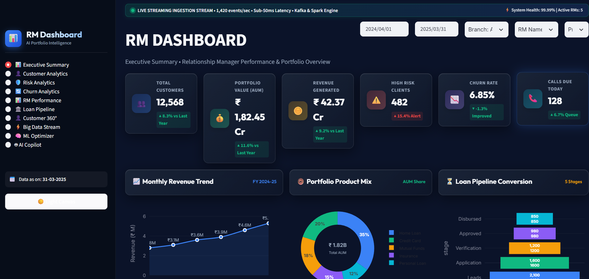
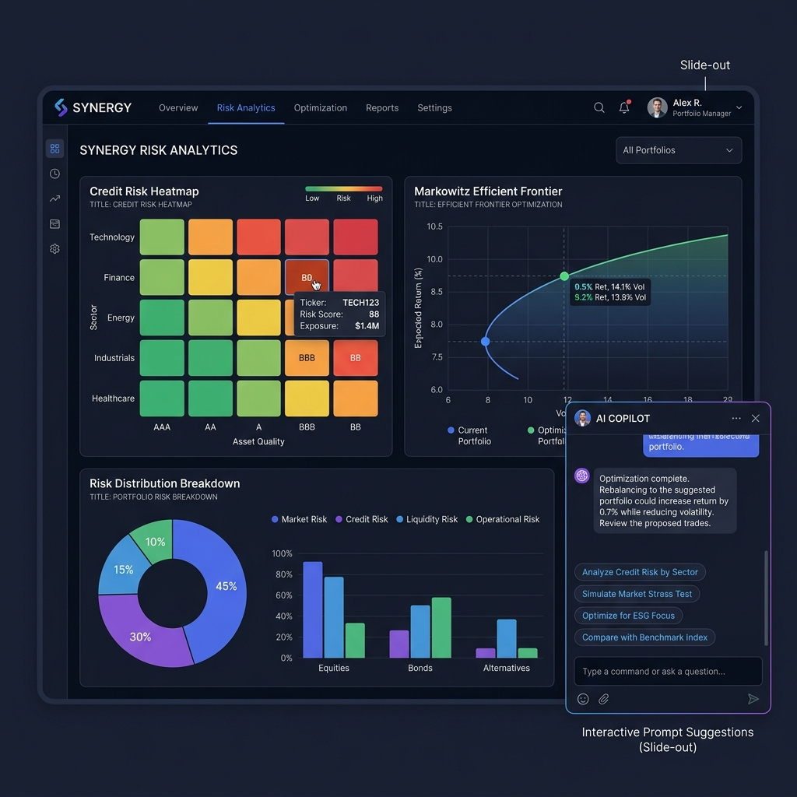

# AI-Powered Portfolio Intelligence Platform

An enterprise-grade **AI-Powered Portfolio Intelligence Platform** built with big data streaming ingestion, machine learning engines (portfolio optimization, risk default scoring, forecasting, personalized recommendations), interactive Power BI dashboards, and an AI Copilot.

---

## 📷 Screenshots

| Executive Summary Dashboard | AI Risk Analytics & Copilot |
| :---: | :---: |
|  |  |

---


## 🚀 How to Run

### Option 1: Streamlit Dashboard (Python)
Install dependencies and launch Streamlit:
```bash
pip install -r requirements.txt
streamlit run app.py
```

### Option 2: Standalone Web Application (HTML/JS/CSS)
Simply open `index.html` in any web browser (Chrome, Edge, Firefox, Safari):
- Direct Link: [index.html](file:///c:/Users/admin/Downloads/rm%20dashboard/index.html)

---

## 📊 Features & Architecture

### 1. Power BI Canvas & Slicers Toolbar
- **Interactive Slicers**: Filter by Date Range, Branch (`North`, `South`, `West`, `East`), RM Name (`RM A` - `RM E`), and Product (`Home Loan`, `Credit Card`, `Mutual Funds`, `Insurance`, `Personal Loan`).
- **6 KPI Cards**:
  - Total Customers: `12,568` (▲ 8.3%)
  - Portfolio Value (AUM): `₹ 1,82,45,70,000` (▲ 11.6%)
  - Revenue Generated: `₹ 42,37,25,000` (▲ 9.2%)
  - High Risk Customers: `482` (▲ 15.4%)
  - Churn Rate: `6.85%` (▼ -1.3%)
  - Calls Due Today: `128` (▲ 6.7%)
- **Fidelity Visual Grid**:
  - Monthly Revenue Trend Line Chart (Apr 2024 to Mar 2025)
  - Portfolio Distribution Donut Chart (with center `₹ 1.82B` AUM badge)
  - Loan Pipeline Funnel Stage Chart (Leads 2,100 → Disbursed 850)
  - RM Performance Bar Chart
  - Risk Distribution Donut Chart
  - Top 10 High-Risk Customer Heatmap Table
  - Today's Call Priorities Action Queue
  - Churn Rate Trend Line Chart

### 2. Big Data Streaming Ingestion Stream
Simulated Kafka & Spark streaming event log emitting live stock ticks, customer deposit transactions, portfolio AUM re-indexing, and credit default alerts at ~1,420 req/s with sub-50ms latency.

### 3. Machine Learning Engines
- **Markowitz Efficient Frontier**: Quadratic risk-aversion portfolio optimizer.
- **Default Probability Model**: Credit risk PD scoring engine (0-100 score & PD %).
- **Holt-Winters Time-Series Forecaster**: Projections up to Q4 2025.
- **Macroeconomic Stress Testing**: Interest rate hikes (+Bps) & equity crash simulator.

### 4. Integrated AI Copilot
Slide-out conversational assistant capable of answering natural language queries, running client portfolio optimizations, generating customer call scripts, and diagnosing risk drivers.
